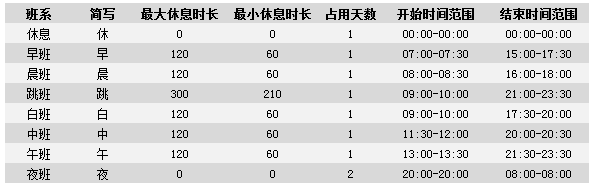
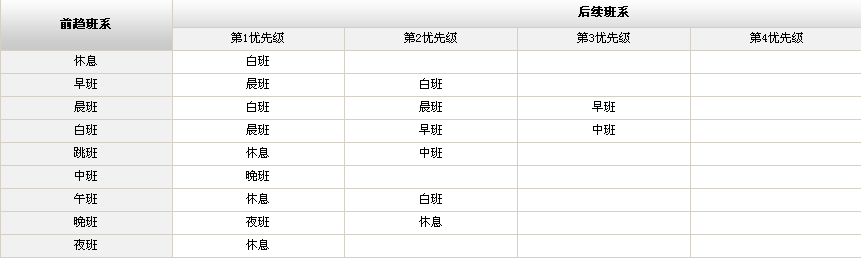
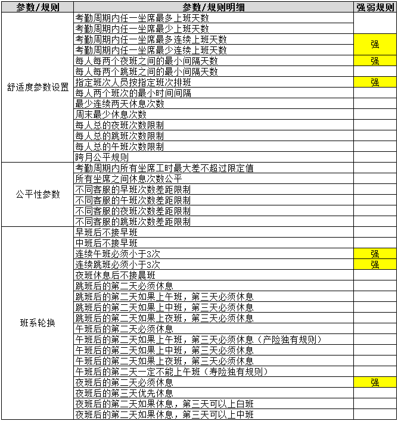

# 客服排班

## 1. 规则描述

### 1.1 排班描述

- 目前按人排班，排班精度为30分钟，按月排班

- 提前一个礼拜发班表，26号的周期作为下个周期的开始时间，大概十五号左右开始排班，到20日发布班表初稿

- 三地（上海、深圳、武汉）统一队列，统一进线；因地域关系各地域班次会有微弱区别

- 人工排班（行政班、免夜班、免特殊班次）也计算话务拟合度，因人力紧张，班长、专家部分时段拟合人力。
  - 行政班就是按照朝九晚五、工作日上班的人；这些人是有效的工作，跟话务拟合计算到一起

### 1.2 排班目标

- 根据业务量、服务水平等关键指标预测出每个时段的人力及每天，每个班次的人力需求

- 排班周期内排班工时、加班时长、休息天数、特殊班次（夜班、午班、跳班）等均需要考虑公平性原则

- 利用积分兑换，坐席可指定日期的排班需求，即坐席指定上特定班、指定休息时间

### 1.3 班次班段规则

- 班段工时最短2.5小时，最长5小时，夜班12小时；

- 班段间隔最短为60分钟，班段间隔最长为5小时

- 一个班次有多个班段，上午上、下午上

- 中餐时间：11: 00-13: 00；晚餐16: 30-18: 30；就餐时间为60分钟-2小时

- 除了夜班之外，最长班次工时为9小时，最短班次工时为7小时，班次设置需要综合考虑员工接受度

- 班次时间是可以调整的，现有的班次库已知

### 1.4 班次人数安排

- 目前排班主要有产险呼入和寿险呼入，20秒服务水平要求96%；接通率要求99.99%，排班指标不区分忙闲日，排班周期内的指标统一

  - 产险平均处理时长215秒，寿险平均处理时长260秒，工时利用率全天按75%。

  - 使用erlang c转换人力，转换后就是**每半个小时需要多少人**

  - 满足半个小时的人力需求就能够满足服务水平要求

- 排班所允许的人力偏差：产险7:00-23:30（-1.7% ，8.4%），即每30分钟排出来的人力，可允许比预测人力少-1.7%，或者可以比预测的人力多8.4%

- 建议排班后计算出空闲时间段，然后在这些空闲时间段排会议、培训或者外呼等等

- 按照小组编号排班，小组编号1为全班次轮转人员，小组编号5为除了夜晚以外班次轮转，小组编号6为行政班人员，小组编号0、4、7为新人、班长、专家部分时段拟合人员。

### 1.5 人员就班规则

- 产险呼入班系见下表：

  

- 轮转规则如下：

    

- 排班要求：

   - 最多连续上班天数：6*天*

   - 最少连续上班天数：2*天*

   - 班次轮换之间时间间隔：特殊班次最好一周一个，夜班间隔需要10*天以上*

   - 当天下班和第二天上班之间最少间隔时间：9*小时*

     - 可以限制午班和夜班不能接着晨班

   - 跳班：一种班次，就是上午上班，中间休息很久，下午偏晚上开始上班，夜里下班

   - 夜班固定人数，但是每个区域必须是大于等于2*个人，三地进行轮流*

     - 产险：8**人（夜班22: 00-8: 00**）；寿险：2**人（夜班20: 30-8: 00**

 

## 2. 规则约定及优先级

### 2.1 规则约定

所有排班需要遵循的限制条件都是规则，其中有强规则为硬规则，不允许挑战突破。其余规则为软规则，相对于硬规则和优先级更高的其他规则。这部分的规则允许少量被突破。

### 2.2 目前排班参数优先级

  
